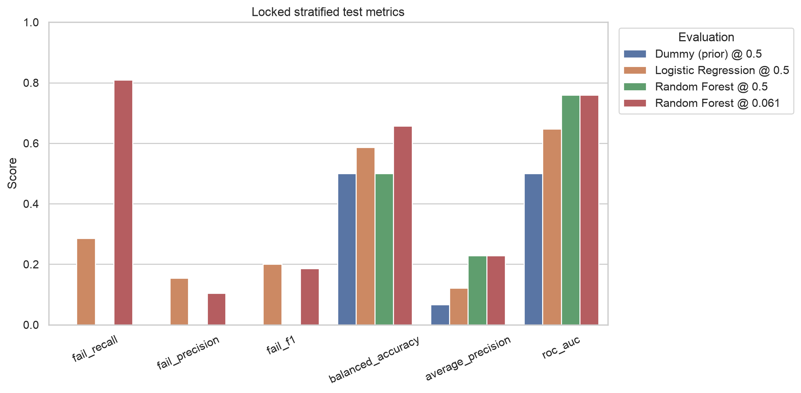
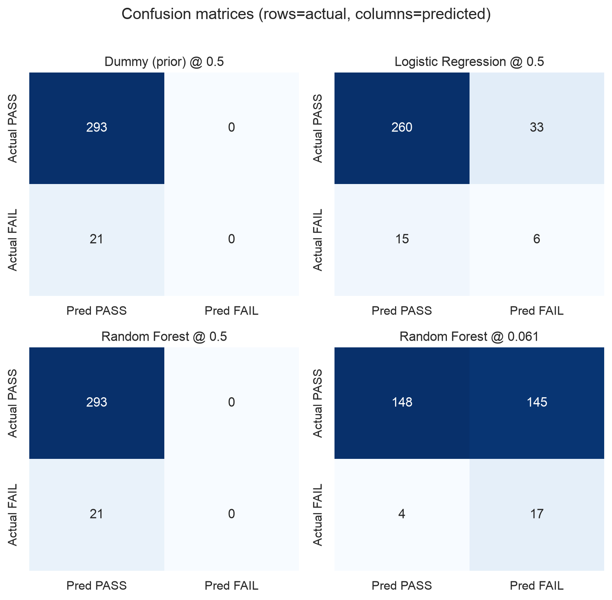
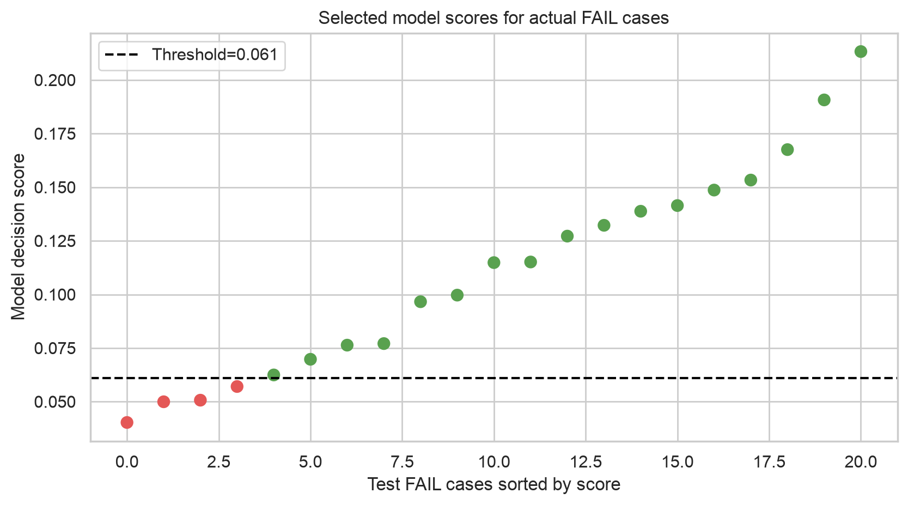
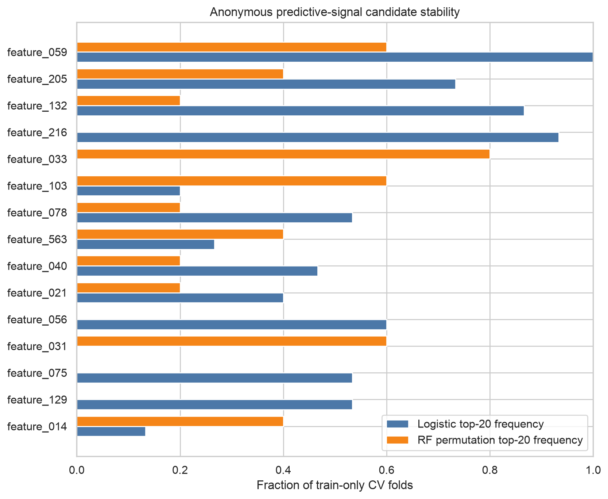
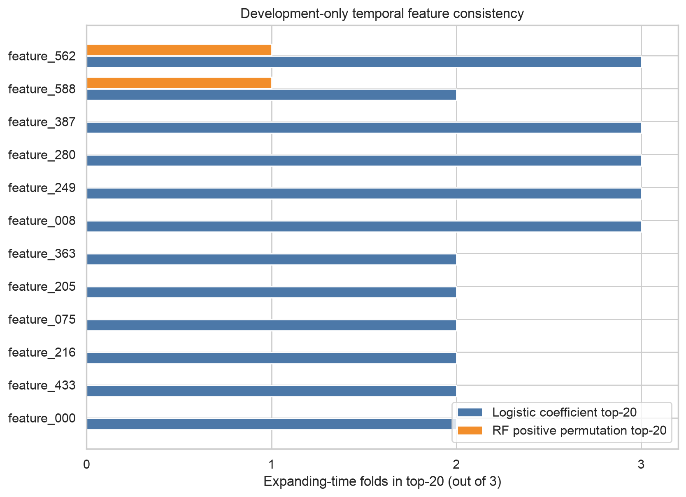

# UCI SECOM 반도체 제조 품질분석 미니 프로젝트

공개·익명화된 SECOM 데이터로 **FAIL을 얼마나 놓치지 않고 선별할 수 있는지**를 검토한 재현 가능한 baseline 프로젝트다. 목적은 생산 적용 성능을 주장하는 것이 아니라, 데이터 품질 점검 → 누수 방지 → 불균형 평가 → False Negative 분석 → 한계 공개까지의 판단 과정을 증명하는 것이다.

> **상태:** 분석 `COMPLETE` / 공개 v1 결과 `FROZEN` (2026-08-23). 데이터·분할·전처리·모델 family·주 임계값·잠금 test·민감도 수치·그림·결론을 동결했으며 추가 모델링·튜닝을 중단했다. 재실행은 재현 확인일 뿐 결과 재선택이 아니다.

> 핵심 결론: 품질 우선 후보 임계값에서 테스트 FAIL 21건 중 17건을 찾았지만 PASS 145건을 오탐했다. 작은 FAIL 표본의 불확실성이 크고 시간순 holdout 성능과 변수 안정성도 약했다. 따라서 현재 결과만으로 현장 적용이나 원인 규명을 주장할 수 없다.

**바로 보기:** [실행 완료 Jupyter Notebook](notebooks/secom_quality_analysis.ipynb) · [Quality Report](reports/quality_report.md) · [Gemma 원본 리뷰](results/gemma_review.md) · [Human Decision Log](docs/GEMMA_REVIEW_DECISIONS.md) · [AI 사용 기록](docs/AI_USAGE.md) · [검증 로그](docs/VALIDATION_LOG.md)

## 핵심 결과

- 공식 원본: 1,567건, 실제 파일 기준 익명 입력 590개
- 라벨: PASS 1,463건, FAIL 104건(6.64%, PASS:FAIL = 14.07:1)
- 결측: 41,951셀(4.54%), 결측 포함 변수 538개
- 관측값 기준 상수 변수: 116개
- 고정 분할: train 1,253건(FAIL 83) / test 314건(FAIL 21), seed 42
- 선택 규칙: train-only 5-fold × 3회 CV의 mean Average Precision(AP)
- 규칙상 선택 모델: Random Forest(CV AP 0.193 ± 0.062; Logistic 0.161 ± 0.062)
- 품질 우선 후보 임계값: train OOF에서 `FAIL Recall ≥ 0.80`을 만족하는 임계값 중 Precision 최대, `0.060939`

| 잠금 테스트 평가 | Precision | Recall | F1 | Balanced Acc. | ROC-AUC | AP | PR-AUC¹ | TN / FP / FN / TP |
|---|---:|---:|---:|---:|---:|---:|---:|---:|
| Dummy @ 0.5 | 0.000 | 0.000 | 0.000 | 0.500 | 0.500 | 0.067 | 0.533 | 293 / 0 / 21 / 0 |
| Logistic @ 0.5 | 0.154 | 0.286 | 0.200 | 0.587 | 0.647 | 0.122 | 0.108 | 260 / 33 / 15 / 6 |
| Random Forest @ 0.5 | 0.000 | 0.000 | 0.000 | 0.500 | 0.759 | 0.229 | 0.207 | 293 / 0 / 21 / 0 |
| Random Forest @ 0.060939 | **0.105** | **0.810** | **0.186** | **0.657** | **0.759** | **0.229** | **0.207** | **148 / 145 / 4 / 17** |

¹ `PR-AUC`는 precision–recall 곡선의 사다리꼴 적분, `AP`는 Average Precision이다. 둘은 보간 정의가 다르다. 특히 모든 점수가 같은 Dummy의 사다리꼴 PR-AUC 0.533은 끝점 선형 보간 때문에 과도하게 커지므로 이 프로젝트는 **AP를 주 비교지표**로 사용한다. 모든 정확한 수치는 [`test_metrics.csv`](results/tables/test_metrics.csv)에 있다.

Random Forest @ 0.5의 Accuracy는 93.31%지만 FAIL을 한 건도 찾지 못했다. 반대로 후보 임계값은 Recall을 80.95%(17/21)로 높였으나 314건 중 162건을 FAIL 후보로 분류했고, 그중 실제 FAIL은 17건뿐이다. 이는 성과 수치가 아니라 **누락 감소와 추가확인 후보 증가의 trade-off**다.

고정 모델·고정 임계값의 test 예측을 true-label-stratified 방식으로 10,000회 bootstrap한 95% 구간은 Recall `0.6190–0.9524`, Precision `0.0818–0.1268`, Balanced Accuracy `0.5621–0.7390`, ROC-AUC `0.6439–0.8632`, AP `0.1402–0.4267`이었다. FAIL 21개로 불확실성이 크다는 뜻이지만 점추정 전체가 무효라는 뜻은 아니다. 이 조건부 구간은 학습·모델선택·임계값선택 불확실성과 외부 기간 변동을 포함하지 않는다. 정확한 값은 [`test_metric_bootstrap_ci.csv`](results/tables/test_metric_bootstrap_ci.csv)에 있다.





## 데이터와 정합성

데이터 출처는 [UCI SECOM](https://archive.ics.uci.edu/dataset/179/secom), 인용은 McCann & Johnston (2008), DOI [10.24432/C54305](https://doi.org/10.24432/C54305), 라이선스는 [CC BY 4.0](https://creativecommons.org/licenses/by/4.0/)이다. UCI 페이지는 591 features라고 적지만 공식 `secom.data`의 모든 행에는 실제 값이 590개다. 이 프로젝트는 임의의 591번째 변수를 만들지 않고 원본 파일 구조인 590개를 사용한다.

`scripts/download_data.py`는 공식 ZIP과 추출 파일을 코드에 고정한 SHA-256과 비교하고, 하나라도 다르면 중단한 뒤 결과를 `data/raw/source_manifest.json`에 기록한다. 현재 원본 실측값은 다음과 같다.

- `secom.data`: SHA-256 `20f0e7ee434f7dcbae0eea9ffff009a2b57f42d6b0dc9a5bd4f00782c0a3374c`
- `secom_labels.data`: SHA-256 `126884cf453705c9e61a903fe906f0665a3b45ce3639e621edc5c93c89627e03`
- 라벨 매핑: UCI `-1 = PASS`, `1 = FAIL`; 코드 내부 `0 = PASS`, `1 = FAIL`
- timestamp: 모델 입력에서 제외하고 시간순 민감도 점검에만 사용

## 누수 방지 설계

1. 원본 정합성과 전체 데이터 기술통계를 먼저 기록한다.
2. seed 42로 80/20 층화 holdout을 한 번 고정한다.
3. median 결측 대치 → 분산 0 변수 제거 → Logistic만 표준화를 `sklearn Pipeline` 안에서 수행한다.
4. 전처리·모델 fitting은 각 train fold에만 적용한다.
5. Dummy, class-weighted Logistic Regression, class-weighted Random Forest를 동일한 반복 CV fold에서 비교한다.
6. 모델 family는 CV AP로, 후보 임계값은 선택 모델의 train-only OOF 예측으로 정한다.
7. 잠금 test는 최종 성능 확인에만 쓰며, test FN을 보고 재학습하거나 임계값을 바꾸지 않는다.

원본의 exact duplicate feature row는 0건이다. 다만 같은 timestamp가 train/test 양쪽에 걸친 그룹이 11개(22행) 있다. timestamp가 batch를 뜻한다는 근거는 없지만 미지의 제조 군집 proxy일 수 있다. 고정 모델·임계값에서 shared timestamp의 test 11행을 제외해도 Recall 0.810과 FN 4건은 같았고, Precision은 0.105에서 0.109로 소폭 높아졌다. 따라서 알려진 exact timestamp 중복이 1차 성능을 부풀린 정황은 없지만, lot/batch ID가 없어 다른 군집 의존성은 통제하지 못했다. 상세 값은 [`shared_timestamp_sensitivity.json`](results/metadata/shared_timestamp_sensitivity.json)에 있다.

## False Negative

후보 임계값에서 놓친 FAIL은 4건이다.

| sample_id | RF score | 결측 수 | 임계값과 차이 |
|---|---:|---:|---:|
| sample_0231 | 0.057080 | 24 | -0.003859 |
| sample_0154 | 0.050705 | 28 | -0.010234 |
| sample_0795 | 0.049960 | 28 | -0.010979 |
| sample_1189 | 0.040310 | 12 | -0.020629 |

FN 결측 수 중앙값은 26, TP는 24지만 FN이 4건뿐이므로 관계를 주장할 수 없다. 테스트 FAIL 한 건이 Recall을 4.76%p 바꾸며, Recall 80.95%의 Wilson 구간도 60.00~92.33%로 넓다. 상세 robust deviation은 [`false_negatives.csv`](results/tables/false_negatives.csv)에 있으나 후속 가설 생성용일 뿐이다.



## 익명 변수 후보

Logistic 표준화 계수의 train-only 15개 반복 fold top-20 빈도와 Random Forest의 train-only 5개 validation fold permutation AP 감소 top-20 빈도를 분리해 기록했다. 두 방법에서 모두 60% 이상 반복된 것은 `feature_059` 하나다.

- `feature_059`: Logistic 15/15, RF permutation 3/5
- Logistic 평균 표준화 계수: +1.309, fold 부호 일치율 100%
- RF 평균 AP 감소: 0.0102, fold 간 표준편차 0.0138

이는 **random-train CV에서 확인된 예측 연관성의 후속 점검 후보**다. 익명화 때문에 센서명·단위·온도·압력·식각 등의 공정 의미나 원인으로 해석할 수 없다. 상관된 변수가 중요도를 나눠 갖거나 대체할 수도 있다.



추가 시간 안정성 검사는 primary test와 미래 holdout의 합집합 557행을 보호하고, 보호 집합과 timestamp가 같은 7행도 제외한 strict development pool 1,003행(FAIL 67)만 사용했다. 세 expanding-time fold에서 Logistic 계수 top-20과 RF의 양수 permutation AP 감소 top-20을 비교한 결과, 두 방법 모두 2/3회 이상 반복된 변수는 0개였다. `feature_059`도 각각 1/3회였다. 따라서 기존 연관성 후보를 소급 무효화하지는 않지만 **시간 안정성은 확인되지 않았다**. Validation FAIL이 15·9·9개뿐이고 expanding train도 중첩되므로 탐색적 consistency screen으로만 해석한다.



## 시간순 민감도

`timestamp → sample_id` 순서를 고정해 2008-07-19~2008-10-02를 학습(1,253건, FAIL 87), 이후 2008-10-17까지를 holdout(314건, FAIL 17)으로 둔 탐색적 검사를 추가했다. 시간순 학습 데이터의 OOF에서만 새 후보 임계값 `0.068235`를 정했지만 미래 holdout에서는 다음과 같았다.

- TN 171 / FP 126 / FN 10 / TP 7
- FAIL Recall 0.412, Precision 0.053, F1 0.093, Balanced Accuracy 0.494
- ROC-AUC 0.540, AP 0.079, PR-AUC 0.068

즉, 무작위 holdout 결과보다 크게 약해졌다. 이는 **distribution shift 또는 temporal instability 가능성**을 보여주지만 spurious correlation이 원인이라고 단정하지 않는다. 모델 family 자체도 전체 기간을 섞은 1차 무작위 분석에서 선택됐기 때문에 이 검사는 완전 독립적인 prospective 평가가 아니라 시간 일반화 위험을 드러내는 민감도 검사다.

## 재현 방법

Python 3.12 환경에서 프로젝트 루트를 기준으로 실행한다.

```bash
python3 -m venv .venv
.venv/bin/python -m pip install -r requirements-lock.txt
.venv/bin/python scripts/download_data.py
.venv/bin/python src/secom_analysis.py
.venv/bin/python scripts/build_notebook.py
.venv/bin/python -m pytest -q
```

느슨한 호환 범위는 `requirements.txt`, 실제 검증 환경은 `requirements-lock.txt`에 있다. 분석은 seed 42, Python 3.12.13, scikit-learn 1.9.0에서 기록했다. `scripts/build_notebook.py`는 고정 split에서 세 baseline을 다시 fit하고 저장 지표와 수치 일치를 assertion으로 확인한 뒤 출력이 포함된 Notebook을 저장한다. 실행에는 환경에 따라 수 분이 걸릴 수 있다.

## 산출물

```text
data/raw/                 공식 원본, UCI 설명, SHA-256 manifest
src/secom_analysis.py     전체 재현 분석 파이프라인
notebooks/                모든 코드 셀이 실행된 증거 Notebook
scripts/                  데이터 다운로드, Notebook 생성, 선택적 Gemma 검토
tests/                    원본·분할·지표·임계값·후보 규칙 검증
results/tables/           CV, test, bootstrap CI, FN, 변수 후보 CSV
results/metadata/         데이터·분할·threshold·시간순·민감도·버전 JSON
results/gemma_review.md   변경하지 않은 Gemma API 독립 리뷰 원본
figures/                  10개 결과 그래프
models/                   train split으로 fit한 선택 모델과 metadata
reports/                  1~2페이지 품질 보고서와 지원서 문장
docs/                     AI 사용·검증 기록, Human Decision Log
```

`models/selected_model.joblib`은 재현 증거용이다. Python pickle 계열 파일은 임의 코드를 실행할 수 있으므로 출처가 다른 모델 파일은 로드하지 말고, 이 저장소에서도 가능하면 분석 스크립트로 다시 생성한다.

## 해석 한계

- 공개된 2008년 익명 데이터이며 현재 SK하이닉스 라인 데이터가 아니다.
- 테스트 FAIL은 21건뿐이며 Recall bootstrap 95% CI도 0.619~0.952로 넓다. 지표는 조건부 추정치이지 외부 성능 보장이 아니다.
- CV AP 규칙상 RF가 선택됐지만 paired 15 fold 중 RF가 LR보다 높았던 것은 8개뿐이다. 압도적 우위가 아니다.
- 임계값 0.060939는 보정된 불량확률 6.1%가 아니며, 운영 비용 기준이 없는 분석 가정이다.
- lot, batch, 장비, recipe, 실제 공정 변수명과 단위가 없다.
- `feature_059`는 원인이 아니라 random-CV 조사 후보이며 development-only 시간 안정성은 확인되지 않았다.
- 외부 기간·현장 데이터, 실제 lot/batch 그룹 분할, 비용행렬, 확률 calibration을 추가 검증해야 한다. 비용자료가 없으므로 cost-optimal threshold는 계산하지 않았다.

## 보고서와 AI 검토

- [`quality_report.md`](reports/quality_report.md): 1~2페이지 요약 보고서
- [`secom_quality_analysis.ipynb`](notebooks/secom_quality_analysis.ipynb): 실제 출력과 assertion을 포함한 실행 Notebook
- [`application_sentences.md`](reports/application_sentences.md): 사실 기반 지원서 문장 초안
- [`AI_USAGE.md`](docs/AI_USAGE.md): 실제 AI 사용 범위와 미실행 항목
- [`gemma_review.md`](results/gemma_review.md): 실제 Gemma 4 26B A4B API 독립 리뷰의 변경 없는 원본 evidence
- [`GEMMA_REVIEW_DECISIONS.md`](docs/GEMMA_REVIEW_DECISIONS.md): 원본 G-01~G-06에 대한 사람의 판정과 Python 조치
- [`GEMMA_OPTIONAL.md`](docs/GEMMA_OPTIONAL.md): 보존된 원본과 별개인 Gemma 4 API 재현 참고 경로
- [`VALIDATION_LOG.md`](docs/VALIDATION_LOG.md): 실행 명령·실패·검증·정확한 파일 목록

사용자는 별도 환경에서 실제 `gemma-4-26b-a4b-it` API 독립 리뷰를 수행했고, 원본 출력은 [`results/gemma_review.md`](results/gemma_review.md)에 내용 변경 없이 보존했다. Gemma의 spurious correlation·모든 지표 무효·현장 도입 불가능 단정은 사람이 기각하거나 완화했고, 수용한 세 검증 의제만 Python으로 확인했다. 원문은 AI 비평 evidence이며 모든 숫자의 source of truth는 Python 산출물이다.

Codex는 분석 구조, 코드 검토, 문서 초안, 반론 생성에 사용했다. AI에는 데이터 개수·평가지표 계산, 임의의 결과 생성, 익명 변수의 공정 의미 추정, test 결과를 본 뒤의 모델·임계값 재선택을 맡기지 않았다. 수치는 Python 실행과 자동 테스트, 예측 CSV 독립 재계산으로 검증했다.
